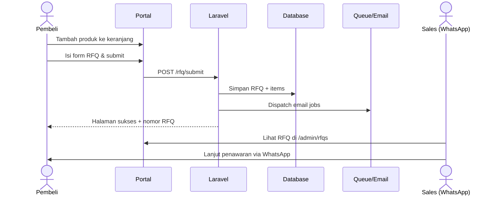

# PT. Prolabios Mitra Analitika — B2B Catalog & RFQ Portal

Platform web katalog B2B + **Request for Quotation (RFQ)** untuk **PT. Prolabios Mitra Analitika** (peralatan laboratorium, reagen, media kultur, instrumen analisis).

Dibangun dengan **Laravel 13**, Blade, Tailwind CSS, dan Vite.

> **Catatan workflow (produksi saat ini):**  
> Setelah pembeli submit RFQ, proses penawaran dilanjutkan **via WhatsApp / Sales**.  
> Alur multi-fase penuh (diskon admin, PDF quotation, approve online, potong stok) **belum** diaktifkan sebagai alur utama — README ini mencerminkan perilaku sistem yang jalan sekarang.

---

## Daftar Isi

1. [Fitur yang tersedia](#fitur-yang-tersedia)
2. [Alur RFQ (aktual)](#alur-rfq-aktual)
3. [Admin panel](#admin-panel)
4. [Keamanan](#keamanan)
5. [Instalasi lokal](#instalasi-lokal)
6. [Deploy checklist](#deploy-checklist)

---

## Fitur yang tersedia

### Publik
- Katalog produk (kategori, subkategori, sektor, pencarian, paginasi)
- Detail produk & halaman beli / stok
- Keranjang RFQ (session) + update qty
- Form RFQ (data perusahaan & kontak) → simpan ke database + notifikasi email (job)
- Halaman sukses RFQ (dilindungi session submitter)
- Halaman profil, sektor, layanan, informasi/artikel, kontak
- Sitemap & robots

### Admin (`/admin`)
- Dashboard
- CRUD produk (tunggal + bulk), kategori, sektor, prinsipal
- CRUD artikel / berita
- Editor homepage, banner, kontak, SEO
- Daftar & detail RFQ masuk
- Audit log aktivitas penting

---

## Alur RFQ (aktual)

```
[1] Jelajah katalog / detail produk
        ↓
[2] Tambah ke keranjang RFQ (session)
        ↓
[3] Checkout — isi data perusahaan & PIC
        ↓
[4] Submit RFQ → nomor unik (RFQ-YYYYMM-XXXXXX)
        ↓
[5] Email konfirmasi (buyer) + alert (internal) via queue job
        ↓
[6] Lanjut negosiasi & penawaran via WhatsApp / Sales
```

### Detail singkat

1. **Keranjang** — item disimpan di session; harga/stok di-refresh dari DB saat checkout bila memungkinkan.
2. **Submit** — validasi form request, honeypot anti-bot, CAPTCHA (jika key diisi), rate limit, transaksi DB (`rfqs` + `rfq_items`).
3. **Sukses** — hanya session yang baru submit nomor tersebut yang bisa buka `/rfq/success/{number}`.
4. **Admin** — melihat daftar RFQ di `/admin/rfqs` untuk follow-up manual (WA).

### Yang belum menjadi alur utama

- Price override / diskon per baris di admin  
- Generate PDF surat penawaran resmi  
- Portal track + approve online + signed URL  
- Auto-decrement stok saat approve  

Fitur-fitur di atas bisa dikembangkan nanti; untuk operasional saat ini **lanjut WA sudah cukup**.



---

## Admin panel

1. Buka `/admin/login` (user dengan `is_admin = true`).
2. Kelola katalog, konten, dan **Penawaran (RFQ)** dari sidebar.
3. RFQ baru → hubungi PIC lewat nomor WA yang tercatat di pengajuan.

---

## Keamanan

| Kontrol | Keterangan |
|--------|------------|
| CSRF | Semua form state-changing |
| Admin middleware | Session + flag `is_admin` |
| Rate limit | Login admin, kontak, submit RFQ |
| Honeypot + CAPTCHA | Form publik (CAPTCHA fail-closed di production jika secret diisi) |
| Upload | MIME check, block SVG, re-encode WebP, simpan di `storage` (public disk) |
| Session | Encrypt; `SESSION_SECURE_COOKIE=true` di production |
| HTML konten | Sanitasi untuk rich text |

Production `.env` minimal:

```env
APP_ENV=production
APP_DEBUG=false
SESSION_SECURE_COOKIE=true
# Isi salah satu:
RECAPTCHA_SITE_KEY=
RECAPTCHA_SECRET_KEY=
# atau
TURNSTILE_SITE_KEY=
TURNSTILE_SECRET_KEY=
```

Setelah deploy:

```bash
php artisan storage:link
php artisan config:cache
php artisan route:cache
php artisan view:cache
```

---

## Instalasi lokal

### Persyaratan
- PHP **8.3+** (`pdo`, `mbstring`, `openssl`, `tokenizer`, `xml`, `gd` direkomendasikan untuk WebP)
- Composer, Node.js 18+, npm
- SQLite (default) atau MySQL/MariaDB

### Langkah

```bash
git clone https://github.com/kamarov28/mockup-prolabios.git
cd mockup-prolabios

cp .env.example .env
# sesuaikan DB & APP_URL

composer install
npm install
php artisan key:generate
php artisan migrate --seed
php artisan storage:link
npm run build

php artisan serve
```

Buka `http://127.0.0.1:8000`.

Admin: buat user admin lewat seeder / tinker (`is_admin = true`), atau ikuti seed yang ada di project.

### Tes (opsional)

```bash
php artisan test
```

Ada feature test untuk auth admin, cart, alur RFQ, dan hardening security.

---

## Deploy checklist

- [ ] `APP_DEBUG=false`, `APP_ENV=production`
- [ ] `APP_KEY` unik, tidak commit `.env`
- [ ] HTTPS + `SESSION_SECURE_COOKIE=true`
- [ ] CAPTCHA keys diisi
- [ ] `php artisan storage:link`
- [ ] Queue worker jalan jika email pakai `database`/`redis` queue
- [ ] Backup database rutin

---

&copy; 2026 **PT. Prolabios Mitra Analitika**
