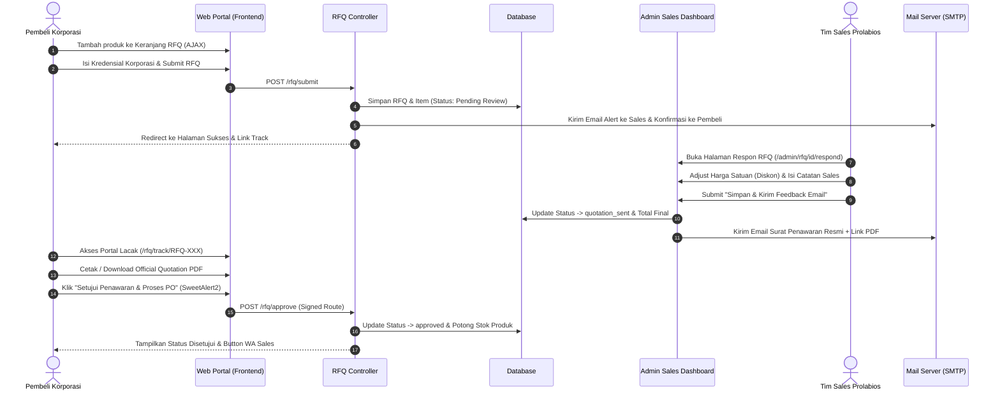

# PT. Prolabios Mitra Analitika — B2B E-Procurement & RFQ Platform

Mockup Prolabios adalah platform web portal B2B modern & sistem *Request for Quotation* (RFQ) resmi milik **PT. Prolabios Mitra Analitika**. Diperkuat dengan **Laravel 13.x**, sistem ini dirancang khusus untuk memenuhi standar pengadaan barang laboratorium, alat analisis, reagen, dan media kultur mikrobiologi berskala korporasi & industri.

---

## 📋 Daftar Isi
1. [🌟 Fitur Utama Platform](#-fitur-utama-platform)
2. [🔄 Alur Lengkap Sistem Pengadaan B2B (RFQ Workflow)](#-alur-lengkap-sistem-pengadaan-b2b-rfq-workflow)
3. [📊 Diagram Alur Sistem (Mermaid Diagram)](#-diagram-alur-sistem-mermaid-diagram)
4. [🛠️ Komponen Teknikal & Fitur Keamanan](#️-komponen-teknikal--fitur-keamanan)
5. [🖥️ Panduan Admin Dashboard & Penyesuaian Diskon](#️-panduan-admin-dashboard--penyesuaian-diskon)
6. [🚀 Panduan Instalasi Lokal](#-panduan-instalasi-lokal)

---

## 🌟 Fitur Utama Platform

*   **⚡ Catalog Carting Tanpa Reload (Asynchronous AJAX):** Pembeli dapat menambahkan produk ke keranjang pengajuan RFQ secara instan tanpa reload halaman, dilengkapi indikator *badge bounce* dan *floating toast notification*.
*   **🛒 B2B RFQ Stepper Checkout:** Formulir pengajuan penawaran bertahap yang mengumpulkan kredensial resmi perusahaan (Nama Korporasi, NIB/NPWP, PIC Procurement, Alamat Pengiriman, dan Spesifikasi Khusus).
*   **📊 Matrix Penyesuaian Harga & Diskon Korporasi:** Tim Sales/Admin dapat menyesuaikan harga satuan (*Price Override*), memberikan diskon kuantitas/volume, dan menambahkan catatan teknis untuk pembeli.
*   **📄 Automatic Official Quotation PDF Generation:** Pembuatan dokumen **Surat Penawaran Harga Resmi (PDF)** secara otomatis lengkap dengan kop surat resmi, rincian nomor katalog, masa berlaku, dan total penawaran.
*   **📧 Automated Email Dispatch & Tracking:** Pengiriman notifikasi email otomatis ke korporasi dan pembeli lengkap dengan tautan pemantauan status real-time (*Signed Route Security*).
*   **🔒 Security & Stock Reservation:** Penguncian/alokasi stok otomatis di basis data setelah penawaran disetujui pembeli untuk mencegah bentrokan stok barang.

---

## 🔄 Alur Lengkap Sistem Pengadaan B2B (RFQ Workflow)

Sistem pengadaan barang B2B di Prolabios terbagi menjadi **7 Fase Utama** yang terintegrasi dari pembeli hingga tim sales & logistik:

```
[FASE 1: Pemilihan Produk]
       ↓
[FASE 2: Checkout Kredensial Korporasi]
       ↓
[FASE 3: Pengajuan RFQ & Notifikasi Email]
       ↓
[FASE 4: Review Admin Sales & Penyesuaian Diskon]
       ↓
[FASE 5: Penerbitan Surat Penawaran Resmi & PDF]
       ↓
[FASE 6: Pemantauan Status & Persetujuan Pembeli]
       ↓
[FASE 7: Alokasi Stok & Proses Pengiriman (Invoice & PO)]
```

---

### 🔹 FASE 1: Pemilihan Produk & Keranjang RFQ (Buyer)
1. Pembeli menjelajahi Katalog Produk di `/produk` atau melihat detail produk.
2. Mengklik tombol **`+ Keranjang RFQ`**.
3. Sistem memproses permintaan melalui AJAX di latar belakang:
   - Angka badge keranjang di navbar atas bertambah dan memberikan efek animasi bounce.
   - Tombol berubah menjadi `✓ Added to RFQ`.
   - Pop-up *Toast Notification* melayang di pojok kanan bawah mengonfirmasi nama item yang berhasil ditambahkan.

### 🔹 FASE 2: Checkout Kredensial Korporasi (Buyer)
1. Pembeli membuka halaman Keranjang Belanja B2B (`/cart`).
2. Pembeli mengatur jumlah kuantitas item menggunakan tombol melingkar `-` dan `+` (*B2B Custom Quantity Stepper*). Subtotal ter-update secara real-time.
3. Pembeli mengklik **`Lanjut Isi Kredensial Korporasi`**.
4. Pembeli melengkapi formulir kredensial resmi:
   - Nama Perusahaan / Instansi
   - Nomor NIB / NPWP Perusahaan
   - Nama & Jabatan PIC Procurement
   - Email Korporasi & Nomor WhatsApp PIC
   - Alamat Lengkap Pengiriman
   - Catatan Spesifikasi / Syarat Khusus (misal: *Butuh Sertifikat COA / ISO*).

### 🔹 FASE 3: Pengajuan RFQ & Notifikasi Email Otomatis (System)
1. Pembeli mengklik tombol **`Terbitkan Pengajuan RFQ`**.
2. Sistem menerbitkan **Nomor RFQ Unik** (contoh: `RFQ-202607-CXMIRC`).
3. Sistem secara otomatis mengirimkan **2 Notifikasi Email**:
   - **Email Notifikasi ke Pembeli**: Konfirmasi bahwa pengajuan penawaran telah diterima dan sedang di-review.
   - **Email Alert ke Tim Sales Admin**: Pemberitahuan adanya pengajuan RFQ baru dari korporasi lengkap dengan tombol direct action **`Buka di Admin Dashboard & Beri Feedback`**.
4. Pembeli diarahkan ke halaman sukses (`/rfq/success/{number}`).

### 🔹 FASE 4: Review Admin Sales & Penyesuaian Diskon (Admin)
1. Tim Sales membuka Admin Dashboard pada menu **Penawaran (RFQ)** (`/admin/rfq`).
2. Mengklik tombol **`Beri Feedback / Respon`** pada nomor RFQ target (`/admin/rfq/{id}/respond`).
3. Tim Sales melakukan **Penyesuaian Harga & Diskon**:
   - **Penyesuaian Harga Satuan (Price Override)**: Sales dapat mengubah angka pada kolom *Harga Satuan (Rp)* untuk memberikan diskon grosir per item.
   - **Pemberian Catatan Diskon Korporasi**: Sales dapat menambahkan catatan khusus pada kolom *Catatan Penawaran Sales*, misal: *"Diberikan diskon volume 5% dan gratis ongkos kirim area Jabodetabek."*
   - **Penetapan Masa Berlaku**: Sales menentukan tanggal batas berlaku penawaran (default 30 hari).

### 🔹 FASE 5: Penerbitan Surat Penawaran Resmi & PDF (Admin & System)
1. Sales mengklik **`Simpan & Kirim Feedback Email ke Korporasi`**.
2. Status RFQ berubah dari `Pending Review` menjadi **`Quotation Sent`** (`quotation_sent`).
3. Sistem secara otomatis menyusun file **Official Quotation PDF** (`/rfq/pdf/{number}`) lengkap dengan:
   - Kop Surat Resmi & Logo PT. Prolabios Mitra Analitika.
   - Nomor RFQ & Tanggal Penerbitan.
   - Tabel Rincian Nomor Katalog, Produk, Kuantitas, Harga Satuan Diskon, dan Total Penawaran.
   - Catatan Spesifikasi & Syarat Ketentuan Penawaran.
4. Sistem mengirimkan **Email Feedback Penawaran Resmi** ke pembeli berisi link lacak dan tombol unduh PDF.

### 🔹 FASE 6: Pemantauan Status & Persetujuan Pembeli (Buyer)
1. Pembeli membuka tautan pemantauan status (`/rfq/track/{number}`).
2. Pada halaman ini, pembeli dapat:
   - Mengunduh/mencetak dokumen **Official Quotation PDF** bertanda tangan resmi.
   - Memeriksa rincian harga akhir setelah diskon.
3. Jika korporasi setuju, pembeli mengklik tombol **`Setujui Penawaran & Proses PO`**.
4. Modal konfirmasi **SweetAlert2** (`Swal.fire`) akan muncul untuk memastikan persetujuan.

### 🔹 FASE 7: Alokasi Stok & Proses Pengiriman (Logistics & Sales)
1. Setelah pembeli menyetujui, status RFQ berubah menjadi **`Disetujui / Approved`** (`approved`).
2. **Penguncian Stok Otomatis (Inventory Reservation)**: Stok produk pada basis data otomatis berkurang sejumlah kuantitas pesanan untuk mengamankan barang dari pembeli lain.
3. Tombol **`Konfirmasi Pengiriman & Invoice via WA`** aktif di halaman pembeli untuk mempermudah komunikasi dengan Sales Engineer.
4. Tim Finance & Logistik Prolabios menerbitkan **Faktur Penjualan (Invoice)** & **Surat Jalan (Delivery Order)** serta mengirimkan pesanan ke alamat korporasi.

---

## 📊 Diagram Alur Sistem (Mermaid Diagram)

### Diagram Urutan (Sequence Diagram)



---

## 🛠️ Komponen Teknikal & Fitur Keamanan

*   **🔐 Signed Route Security (`URL::signedRoute`):** Endpoint persetujuan penawaran (`/rfq/approve/{number}`) dilindungi dengan tanda tangan kriptografi berbasis URL untuk mencegah manipulasi form oleh pihak ketiga.
*   **🛡️ Rate Limiting (`throttle:10,1`):** Form submit pengajuan RFQ dilindungi dengan pembatas laju transaksi untuk mencegah spam.
*   **📄 Blade PDF Renderer:** Templating Surat Penawaran Resmi dirancang khusus menggunakan CSS print-ready modern tanpa membutuhkan library eksternal yang berat.
*   **💬 Integrated SweetAlert2 UX:** Dialog persetujuan transaksi B2B dan konfirmasi penghapusan barang menggunakan modal interaktif SweetAlert2.

---

## 🖥️ Panduan Admin Dashboard & Penyesuaian Diskon

1. **Login ke Admin Panel**: Akses URL `/admin/login` menggunakan kredensial admin resmi.
2. **Navigasi Penawaran (RFQ)**: Pilih menu **Penawaran (RFQ)** pada sidebar kiri.
3. **Merespon Pengajuan**:
   - Cari nomor RFQ atau nama perusahaan yang mengajukan.
   - Klik tombol **`Respon / Beri Feedback`**.
4. **Memberikan Diskon**:
   - Ubah angka pada input **Harga Satuan (Rp)** untuk produk yang ingin didiskon.
   - Isi instruksi/diskon pada textarea **Catatan Penawaran Sales untuk Korporasi**.
   - Klik **Simpan & Kirim Feedback Email ke Korporasi**.

---

## 🚀 Panduan Instalasi Lokal

### Persyaratan Sistem
*   PHP `^8.3` (Extension: `pdo`, `mbstring`, `openssl`, `tokenizer`, `xml`)
*   Composer
*   Node.js `^18.0` & npm
*   MySQL / MariaDB Database

### Langkah-Langkah Instalasi
1.  **Clone Repository:**
    ```bash
    git clone c:\laragon\www\mockup-prolabios
    cd mockup-prolabios
    ```

2.  **Konfigurasi Environment:**
    ```bash
    cp .env.example .env
    ```
    Sesuaikan kredensial database & SMTP email pada `.env`:
    ```env
    DB_DATABASE=mockup_prolabios
    DB_USERNAME=root
    DB_PASSWORD=

    MAIL_MAILER=smtp
    MAIL_HOST=smtp.gmail.com
    MAIL_PORT=465
    MAIL_USERNAME=your-email@gmail.com
    MAIL_PASSWORD=your-app-password
    MAIL_ENCRYPTION=ssl
    ```

3.  **Jalankan Setup & Migration:**
    ```bash
    composer install
    npm install
    php artisan key:generate
    php artisan migrate --seed
    npm run build
    ```

4.  **Jalankan Server Lokal:**
    ```bash
    php artisan serve
    ```
    Buka `http://127.0.0.1:8000` pada browser Anda.

---

&copy; 2026 **PT. Prolabios Mitra Analitika**. *Professional, Robust, Offering the best.*